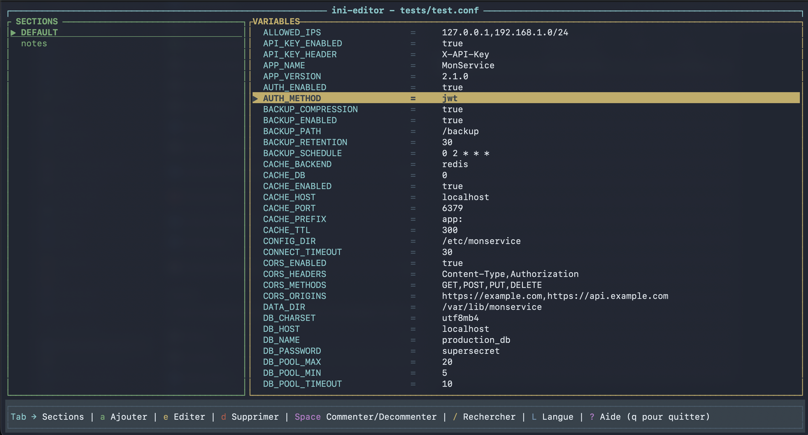

# inedit-cli

A terminal-based INI/conf file editor built in Rust with interactive TUI navigation. Edit configuration files with full keyboard control, multi-language support (27 languages), and search functionality.

[](https://github.com/filoucrackeur/inedit-cli/actions/workflows/ci.yml)
[](https://github.com/filoucrackeur/inedit-cli/actions/workflows/release.yml)
[](LICENSE)
[](https://github.com/filoucrackeur/inedit-cli/releases/latest)
[](https://github.com/filoucrackeur/inedit-cli/releases)
[](https://github.com/filoucrackeur/inedit-cli/commits/main)
[](https://github.com/filoucrackeur/inedit-cli/graphs/contributors)
[](https://github.com/filoucrackeur/inedit-cli/issues?q=is%3Aissue+is%3Aclosed)
[](https://github.com/filoucrackeur/inedit-cli/issues)
[](https://github.com/filoucrackeur/inedit-cli/stargazers)
[](https://github.com/filoucrackeur/inedit-cli/network/members)
[](https://github.com/filoucrackeur/inedit-cli/watchers)
[](https://www.rust-lang.org/)
[](https://github.com/ratatui-org/ratatui)

## Screenshot



## Features

- **Full keyboard navigation**: Tab to navigate between panels, arrow keys for lists
- **CRUD operations**: Add, edit, delete sections and variables
- **Comment/Uncomment**: Toggle `#` prefix on variables
- **Search**: Find sections and variables with `/`
- **Multi-language (i18n)**: 27 languages via `-l` flag or `L` key
- **Format support**: INI files (with `[section]`) and .conf files (Unix-style without sections)

## Installation

### From Source

```bash
git clone https://github.com/filoucrackeur/inedit-cli.git
cd inedit-cli
cargo build --release
```

The binary will be at `target/release/inedit-cli`.

### Pre-built Binaries

See the [Releases](https://github.com/filoucrackeur/inedit-cli/releases) page for pre-built binaries.

### Via Package Managers

#### Linux (Debian/Ubuntu)
```bash
sudo dpkg -i inedit-cli_*.deb
```

#### Linux (Fedora/RHEL)
```bash
sudo dnf install inedit-cli-*.rpm
```

#### Linux (AppImage)
```bash
chmod +x inedit-cli-*.AppImage
./inedit-cli-*.AppImage
```

#### Linux (Snap)
```bash
sudo snap install inedit-cli
```

#### Linux (Flatpak)
```bash
flatpak install inedit-cli.flatpak
```

#### macOS
```bash
brew untap filoucrackeur/inedit-cli
brew install inedit-cli
```

#### Windows (Chocolatey)
```powershell
choco install inedit-cli
```

#### Windows (Winget)
```powershell
winget install filoucrackeur.inedit-cli
```

## Usage

```bash
# Open an INI file
inedit-cli config.ini

# Open a .conf file
inedit-cli /etc/app.conf

# Change language (e.g., French)
inedit-cli -l fr config.ini

# List available languages
inedit-cli -l
```

## Keyboard Commands

| Key | Action |
|-----|--------|
| `Tab` | Navigate between panels |
| `↑/↓` | Move in lists |
| `a` | Add section or variable |
| `e` | Edit value/key |
| `d` | Delete |
| `Space` | Comment/Uncomment |
| `Ctrl+S` | Save and exit |
| `q` | Quit without saving |
| `?` | Help |
| `/` | Search |
| `L` | Change language |

## Supported File Formats

- **INI files**: Standard Windows INI format with sections `[section]`
- **CONF files**: Unix/Linux configuration files, often without explicit sections

## Building from Source

### Prerequisites

- Rust 1.70 or later
- Cargo (comes with Rust)

### Build Instructions

```bash
# Clone the repository
git clone https://github.com/filoucrackeur/inedit-cli.git
cd inedit-cli

# Build release version
cargo build --release

# Run
./target/release/inedit-cli your-file.ini
```

## Contributing

Contributions are welcome! Please feel free to submit a Pull Request.

## License

MIT License - see [LICENSE](LICENSE) for details.

---

<p align="center">
  Made with ❤️ in France
</p>